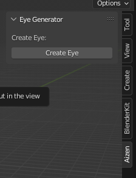
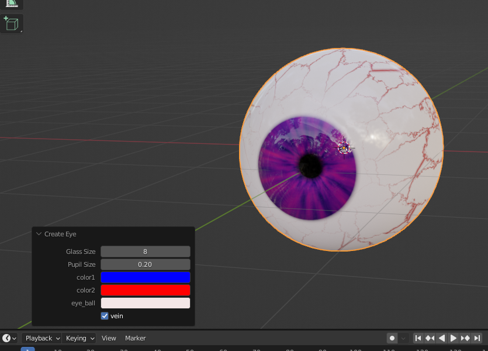
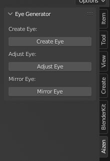
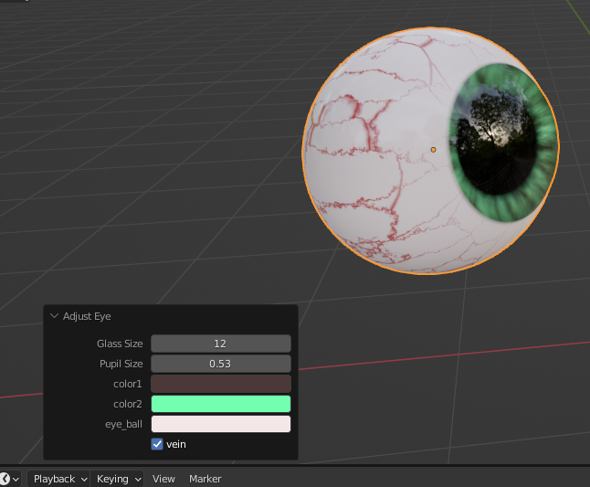
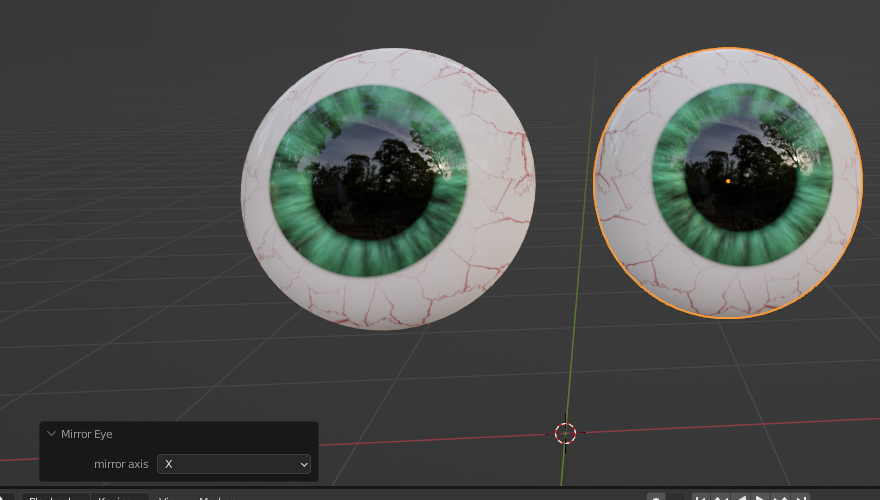

# aizen
## Description
This is a Blender addon to create eye balls.

## Install
Download ZIP and install through Blender Preferences.

## Usage
### Create

    
    

### Adjust
After an eye ball being scaled, rotated, and moved, it can still be adjusted (change properties like create). Only when eye ball elected.

    
    

### Mirror
Mirror an eye ball in X,Y,Z axis. Only when eye ball elected.

    
    

